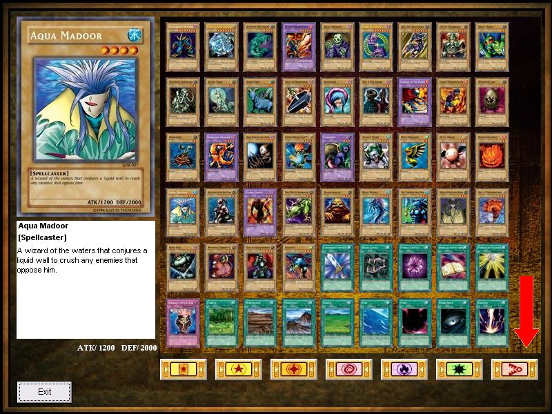



## YuGiOh Card Library v2 \(Updated\)

### Description

This code can give details of cards from the Yu-Gi-Oh! TCG and card pictures. Right now it only has cards from the LOB(Legend of Blue-Eyes White Dragon) expansion set. I will add more sets when I finish typing them up. You can also sort the cards by Normal, Effect, Fusion, Ritual (No cards available), Magic(Spell), and Trap. I might add other sorting methods later. As of now the program is complete. I have done a lot of testing to make sure there are no bugs. If you discover a problem(bug), please feel free to let me know. If you're feeling daring enough, you can add you own cards to the library. I have included instructions on how to do so. The only 2 requirements are that you need to have RICHTX32.ocx and MSCOMCTL.ocx installed. Please post any feedback. Your feedback will make this a better program.

Now has Search Engine just like Yugioh Virtual Desktop.

Next to come, automatic alphabetical sorting.
 
### More Info
 

             |
---                |---
**Submitted On**   |2005-08-06 16:29:06
**By**             |[Chuck the Tech](https://github.com/Planet-Source-Code/PSCIndex/blob/master/ByAuthor/chuck-the-tech.md)
**Level**          |Intermediate
**User Rating**    |4.7 (14 globes from 3 users)
**Compatibility**  |VB 6\.0
**Category**       |[Games](https://github.com/Planet-Source-Code/PSCIndex/blob/master/ByCategory/games__1-38.md)
**World**          |[Visual Basic](https://github.com/Planet-Source-Code/PSCIndex/blob/master/ByWorld/visual-basic.md)
**Archive File**   |[YuGiOh\_Car192178862005\.zip](https://github.com/Planet-Source-Code/chuck-the-tech-yugioh-card-library-v2-updated__1-61909/archive/master.zip)

